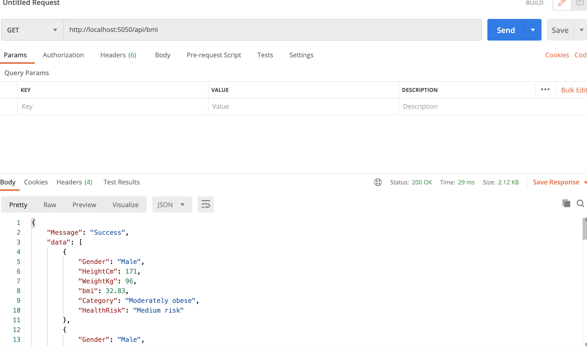
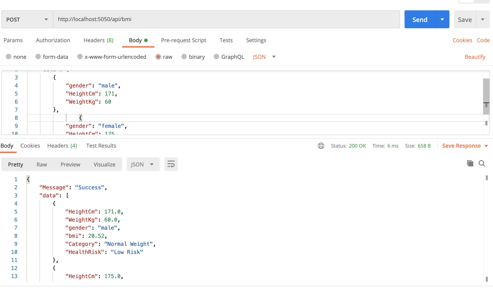

# Coding Assignment

##About Project
* This Project Calculates the BMI And BMI Category based on some basic data like weight, height.
* This is Flask based production ready backend app.
* This Project is basically built with Flask Restful. I have created many features to this app like API
  level Exception Handling, Logging, CORS Preflight.
* Using the BMI API we can get the BMI, category, health risk parameter based on basic data given.
* I have tried to follow the best practices and also the PEP-8 conventions. I have Added Functional level 
  Comment and Function Test cases as well.

## How to setup
 1. Install Python 3.6 or above.
 2. Create Virtualenv using following command(Change python3.6 to your version). 
 ```virtualenv bmi_app --python=python3.6```
 3. Now activate the virtualenv using following command.
 ```source bmi_app/bin/activate```
 4. After Activation we will install the required libs using following command.
 ```pip install -r requirements.txt```
 5. After installation we are ready to run the server using following command.
 ```python app.py```
 
## Run Test Cases
* To run the all test cases use following command to test
```nosetests unittests/ -sv --with-xunit --xunit-file=nosetests.xml --with-coverage```
* It will create the coverage file


## Automate the setup, build, test and package using docker.
* Use following command to create image of our app.
  ```sudo docker build --tag bmi-app .  ```
* once it completes need to run the container using following command
  ```sudo docker run --name bmi-app -p 5050:5050 bmi-app```
  

## Sample Screen shots 
### GET API Screen shot
<p align="center">
    
<p>

### POST API Screen shot
<p align="center">
    
<p>
